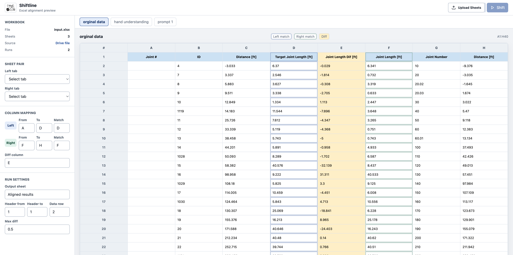

# Shiftline

Shiftline is a algorithm for aligning two ordered sequences and
exports a sheet where rows are optimally algined.

Built for my mom, who had spreadsheet data that needed to be shifted
into alignment via manually inserting rows, checking distances, and copying
formatting by hand.

<p align="center">
  
</p>

## the problem 
Sensors travel through huge oil pipelines multiple times a year to calculate erosion and perform health checks on kilometers of pipelines.
Then data data analysts (like my mom) are responsible for calculating the difference between inspection runs and create reports.

Sometimes new welds are added between inspection runs, which changes the sequence of weld joints recorded by the sensor. This creates gaps or offsets when comparing the new run against previous runs, because the same physical locations are not same sensor numbered snapshot.
Comparing runs of the same section of pipeline - data can have missing rows, extra rows, or values that are close but not equal which is all expected.

Analysts spend hours going through runs, manually shifting entire columns, and recalculating the joint difference for the next shift.


## user flow

- Upload a workbook.
- select a "left" and "right" column to compare.
- select a tolerance (max diff)
- shift!
- download

## the algorithm

each selected columns is a ordered numeric sequences.

1. reads the left and right match columns from the workbook.
2. scores possible pairings using a threshold-based match rule.
3. uses dynamic programming sequence alignment to preserve order while
   deciding where gaps should be inserted.
4. backtracks through the DP table to build the final row alignment.
5. writes a new worksheet, copying the original cell values and styles with
   `openpyxl`.
   
## configurables
- Max diff is the tolerance for deciding whether two distance values are “close enough” to be treated as a match.
Example:
Previous run distance: 100.00
New run distance: 100.03
Max diff for a match: 0.05

## example(s)!

algorithm decides where gaps should be inserted in the alignment. Those gaps determine which side gets shifted down.

### 1. Values Match

```text
Previous run: 100.00
New run:      100.03
Max diff:       0.05
```

The difference is `0.03`, so these rows are treated as a match.

### 2. Missing Row

```text
Previous run: 100.00, 120.00, 140.00
New run:      100.02,         140.01
```

The algorithm inserts a gap for `120.00` so the rest of the rows stay aligned.

### 3. Extra Row

```text
Previous run: 100.00,         140.00
New run:      100.02, 120.00, 140.01
```

The algorithm inserts a gap on the previous run side for the extra `120.00` value in the new run.
