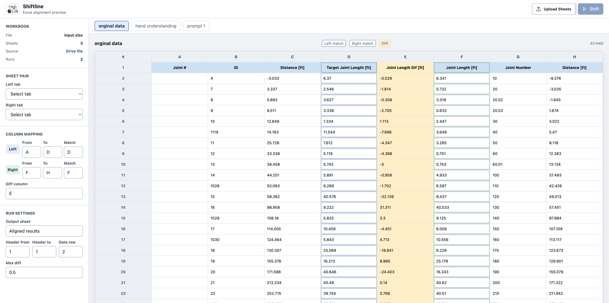

# Shiftline

Shiftline is a algorithm for aligning two ordered sequences and
exports a sheet where rows are optimally algined.

Built for my mom, who had spreadsheet data that needed to be shifted
into alignment via manually inserting rows, checking distances, and copying
formatting by hand.

<p align="center">
  
</p>


## the problem 
Sensors travel through huge oil pipelines multiple times a year to calculate erosion and perform health checks on kilometers of pipelines.
Then data data analysts (like my mom) are responsible for calculating the difference between inspection runs and create reports.

Sometimes new welds are added between inspection runs, which changes the sequence of weld joints recorded by the sensor. This creates gaps or offsets when comparing the new run against previous runs, because the same physical locations are not same sensor numbered snapshot.
Comparing runs of the same section of pipeline - data can have missing rows, extra rows, or values that are close but not equal which is all expected.

Analysts spend hours going through runs, manually shifting entire columns, and recalculating the joint difference for the next shift.

<p align="center">
  
</p>


## user flow

- Upload a workbook.
- select a "left" and "right" column to compare.
- select a tolerance (max diff)
- shift!
- download

## Large workbooks (up to 10,000 data rows)

The default **Automatic** mode keeps a direct download for small workbooks. Above
1,000 data rows, above 2 MB, or when **Large workbook** is selected, the upload
returns a job identifier and the browser polls for progress. A quick job that
takes more than four seconds also switches to polling without uploading again.
The upload meter measures bytes sent; processing shows actual stages rather than
an estimated percentage. The result is an explicit, retryable download link.

- The server enforces **10,000 data rows per selected input sheet**, excluding
  headers. Interior blank rows count toward the row span; formatting-only trailing
  rows do not. The aligned output may have more rows because alignment inserts gaps.
  Files over the limit are rejected, never silently truncated.
- The XLSX file limit is **25 MB**. Additional limits keep unusual files from
  exhausting a small server: 80 MB expanded XLSX contents, 400,000 stored cells
  across the whole workbook, and 64 columns across the two copied blocks.
- Only **one workbook process** runs at once, with at most two additional accepted
  uploads/jobs waiting. Extra submissions receive a retryable busy message.
  CPU work and workbook memory live in a disposable child process, not in the
  web server. On Linux the child is limited to 384 MB of address space; jobs have
  a ten-minute deadline. Excess formatting or very wide files may need simplifying
  even if they are below the row limit.
- Refreshing the same browser tab resumes status checks using its saved job ID.
  A dropped response is checked before retrying an upload. Duplicate upload IDs
  reuse the existing job. If sign-in expires, sign in again in the same tab.
- Inputs are removed after completion/failure. Results expire after one hour;
  admission pauses when retained workbook files exceed 256 MB. Cleanup runs every
  minute. Job routes and downloads use the existing password gate.
- The preview reads only 45 rows in a browser worker and is skipped above 5 MB.
  Preview failure never prevents uploading.

### Run and deploy

Use a **single Render instance with one Uvicorn worker**, matching the existing
deployment. No Redis, external queue, or new paid service is required:

```sh
pip install -r requirements.txt
uvicorn app:app --host 0.0.0.0 --port "$PORT" --workers 1
```

The job supervisor uses an OS file lock to reject multiple web workers sharing a
job directory (Linux/macOS). `/healthz` is a public, constant health response;
configure it as Render's health check path. All workbook routes remain protected.
`SHIFTLINE_DATA_DIR` can relocate the usage database and temporary jobs directory.
Use a persistent `SHIFTLINE_AUTH_SECRET` if login cookies should survive restarts.

This lightweight queue **does not promise survival across Render restarts or
free-instance sleep**. With retained files, interrupted jobs become explicit
failures on startup; with Render's ephemeral filesystem, the browser reports
that the job is unavailable and requests a fresh upload. Download completed
results promptly. Multiple instances or durable jobs would require shared
storage and an external queue.

### Validation

```sh
pip install -r requirements-dev.txt
python -m unittest discover -s tests -v
```

The generated 10,000-row fixture includes styles, formulas, and missing/extra
matches. Tests upload it through the HTTP API, poll health while it runs, download
the result, and verify row order, formulas, styles, and untouched source sheets.
Boundary, authentication, duplicate-submission, timeout, queue, restart, and
expiration tests accompany it. Linux CI also exercises the worker memory cap.

For a deployment smoke test, upload a 10,000-row workbook, confirm the upload
returns `202`, refresh during processing, and download the completed result.
Then verify that 10,001 data rows produces the limit message. The logs include
job IDs, row counts, and Render request IDs, without workbook contents.

## the algorithm

each selected columns is a ordered numeric sequences.

1. reads the left and right match columns from the workbook.
2. scores possible pairings using a threshold-based match rule.
3. uses dynamic programming sequence alignment to preserve order while
   deciding where gaps should be inserted.
4. backtracks through the DP table to build the final row alignment.
5. writes a new worksheet, copying the original cell values and styles with
   `openpyxl`.
   
## configurables
- Max diff is the tolerance for deciding whether two distance values are “close enough” to be treated as a match.
Example:
Previous run distance: 100.00
New run distance: 100.03
Max diff for a match: 0.05

## example(s)!

algorithm decides where gaps should be inserted in the alignment. Those gaps determine which side gets shifted down.

### 1. Values Match

```text
Previous run: 100.00
New run:      100.03
Max diff:       0.05
```

The difference is `0.03`, so these rows are treated as a match.

### 2. Missing Row

```text
Previous run: 100.00, 120.00, 140.00
New run:      100.02,         140.01
```

The algorithm inserts a gap for `120.00` so the rest of the rows stay aligned.

### 3. Extra Row

```text
Previous run: 100.00,         140.00
New run:      100.02, 120.00, 140.01
```

The algorithm inserts a gap on the previous run side for the extra `120.00` value in the new run.
